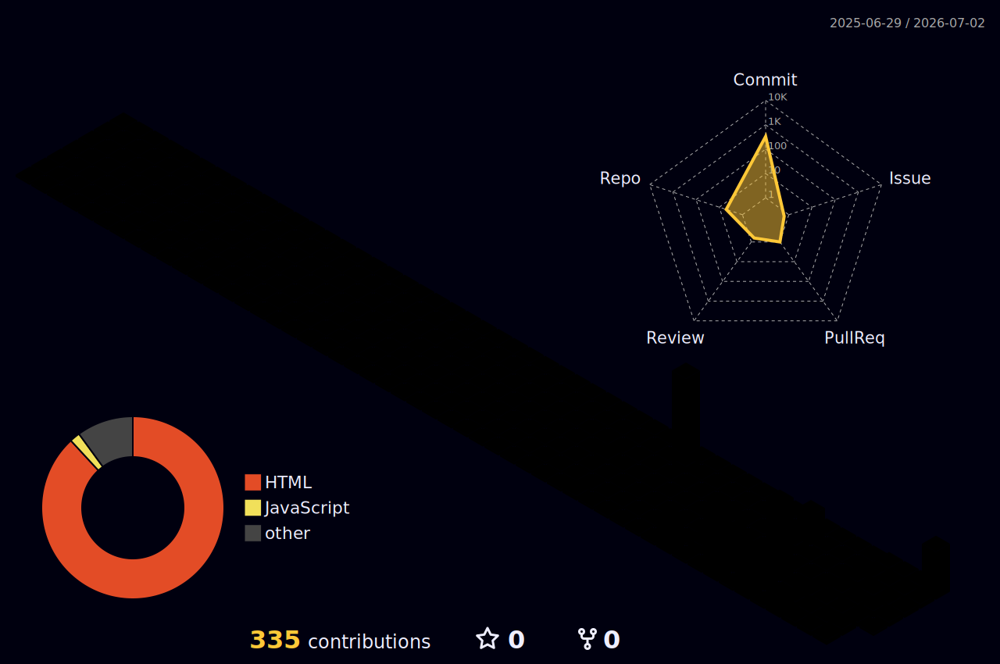

  

  
  
  

<h2 align="center">Hi, I'm Arraffi 👋</h2>

  Student developer from Indonesia building bots, APIs, dashboards, and automation tools.
   
  I like turning messy systems into something fast, usable, and maintainable.

---

## 🚀 Current Focus

- Maintaining **MikirBot**, a WhatsApp bot ecosystem with plugin/case support.
- Maintaining [`@konaa/baileys`](https://www.npmjs.com/package/@konaa/baileys), a Baileys RC build with Kiu/MikirBot compatibility shims.
- Building and improving API/web projects like BerAPI and class/personal websites.
- Experimenting with automation, GitHub tooling, and developer workflows.

---

## 🧰 Tech Stack

  

---

## 📦 Maintained / Highlight Projects

<table>
  <tr>
    <td width="50%">
      <h3>@konaa/baileys</h3>
      
Maintained Baileys RC build with legacy Kiu/MikirBot compatibility shims.

      

        <a href="https://github.com/Konaimav2/baileys">Repository</a> ·
        <a href="https://www.npmjs.com/package/@konaa/baileys">npm</a>
      

    </td>
    <td width="50%">
      <h3>MikirBot</h3>
      
WhatsApp bot development, plugins, rich replies, media tools, and automation experiments.

      
Private / active development

    </td>
  </tr>
  <tr>
    <td width="50%">
      <h3>BerAPI</h3>
      
API panel, docs, endpoint monitoring, quota/admin systems, and service hardening.

      
Private / active development

    </td>
    <td width="50%">
      <h3>Random</h3>
      
Public experiments, utilities, and sandbox code.

      
<a href="https://github.com/Konaimav2/Random">Repository</a>

    </td>
  </tr>
</table>

---

## 📊 GitHub Stats

  
  

  

  

---

## 🧱 Contribution Graph

  

  

---

## 🐍 Contribution Snake

  <picture>
    <source media="(prefers-color-scheme: dark)" srcset="https://raw.githubusercontent.com/Konaimav2/Konaimav2/main/dist/github-contribution-grid-snake-dark.svg" />
    <source media="(prefers-color-scheme: light)" srcset="https://raw.githubusercontent.com/Konaimav2/Konaimav2/main/dist/github-contribution-grid-snake.svg" />
    
  </picture>

> Snake and 3D contribution SVGs are generated automatically by GitHub Actions.

---

## 🛠️ Maintainer Notes

- Prefer compatibility shims over replacing modern internals.
- Keep public packages documented and reproducible.
- Test runtime behavior before publishing releases.

  

